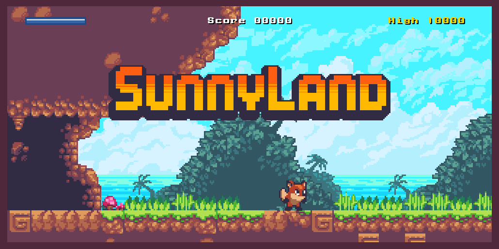

# Sunny Land 2D



## Descripción

Sunny Land 2D es un videojuego de plataformas desarrollado en Unity. En este juego, los jugadores se embarcan en una aventura a través de coloridos y desafiantes niveles, recolectando objetos y evitando obstáculos para completar su misión.

## Características

- **Plataformas Clásicas**: Disfruta de un juego de plataformas con mecánicas tradicionales.
- **Gráficos Coloridos**: Gráficos en 2D vibrantes y detallados.
- **Desarrollo en Unity**: Creado utilizando el motor de juego Unity, asegurando un rendimiento óptimo y una experiencia de usuario fluida.

## Instalación

1. Clona el repositorio:
    ```sh
    git clone https://github.com/migueelrb/Videojuegos.git
    ```

2. Navega al directorio del proyecto:
    ```sh
    cd Videojuegos
    ```

3. Abre el proyecto en Unity:
    - Abre Unity Hub.
    - Selecciona `Add` y navega hasta el directorio del proyecto.
    - Selecciona la carpeta del proyecto y ábrela.

## Cómo Jugar

1. Usa las teclas de dirección para mover al personaje.
2. Salta y esquiva los obstáculos.
3. Recolecta objetos para ganar puntos.
4. Completa los niveles para avanzar en el juego.

## Requisitos del Sistema

- **Sistema Operativo**: Windows 10, macOS 10.12+, Ubuntu 18.04+
- **Procesador**: Intel Core i5 o superior
- **Memoria**: 8 GB de RAM
- **Gráficos**: NVIDIA GeForce GTX 660 o AMD Radeon HD 7950
- **Almacenamiento**: 2 GB de espacio disponible

## Contribuciones

Las contribuciones son bienvenidas. Para reportar problemas o solicitar nuevas características, por favor utiliza el sistema de [issues](https://github.com/migueelrb/Videojuegos/issues).

## Licencia

Este proyecto está licenciado, queda prohibido su modificacion y distirbución sin previa autorización

---

**Desarrollado por Miguel Real**

